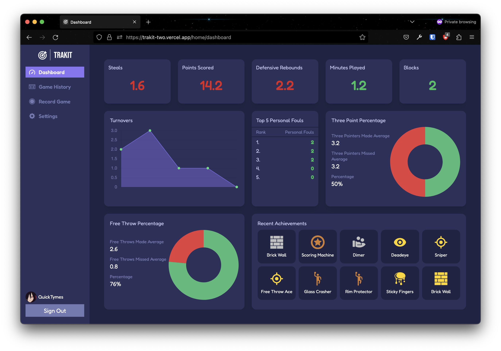
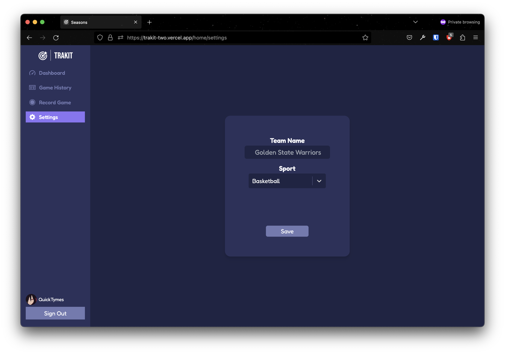
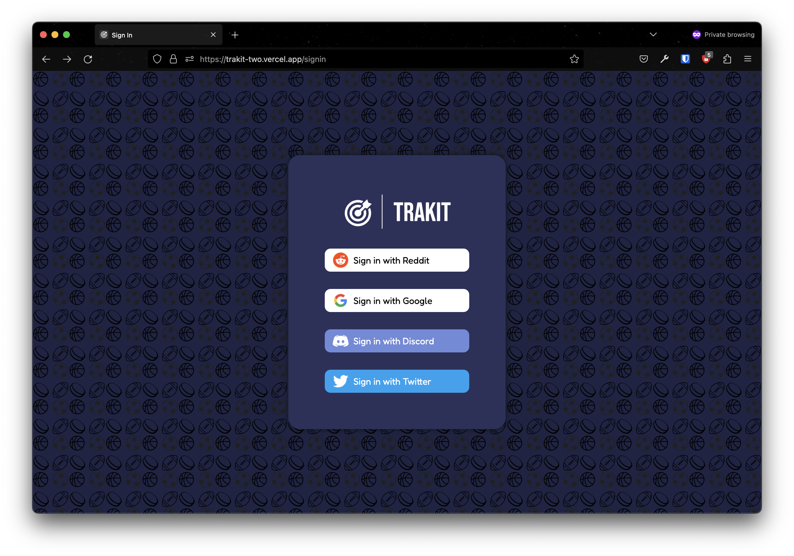
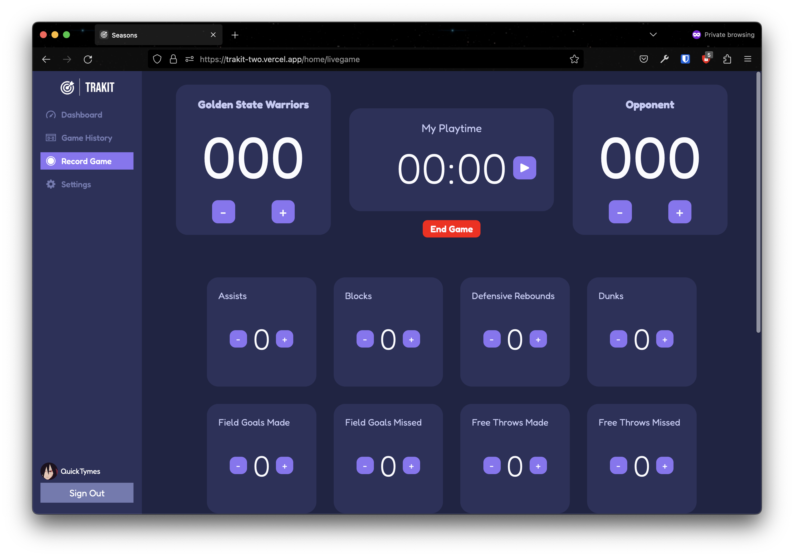

# TrakIt

A web application designed using Next.Js and Tailwind CSS that allows you to effortlessly store, analyze, and visualize your personal sports statistics. Whether you're an amateur athlete, a seasoned competitor, or just someone who enjoys keeping track of their sports performance, TrakIt is the perfect tool to monitor your progress and gain valuable insights. The application allows you to enter and store various sports-related statistics, including scores, times, distances, goals, assists, and more. The website currently supports 4 sports which are soccer, basketball, hockey, and football. It offers a comprehensive dashboard that provides a visual overview of your sports performance. The dashboard displays interactive charts, graphs, and other visualizations, enabling you to understand trends, track improvements, and identify areas for growth.

# Instructions/Notes

Visit [Trakit](https://trakit-two.vercel.app/)

# Contributers
Junior Green<<juniorgreen9185@hotmail.com>>

# Gallery
**Dashboard**

**Settings**

**Login**

**Record Game**

